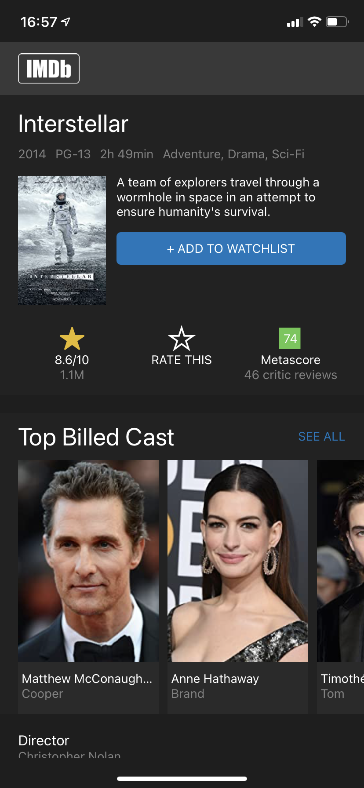

# IMDB INTERSTELLAR CLONE 🚀

🌤 May 2021  
✨ Frontend - First mini project in React Native 🤗

## 🌈 Overview - Welcome dude

---

IMBd Interstellar clone made at [Le Reacteur](https://www.lereacteur.io/) Bootcamp.  
1 screen is available: Interstellar IMBd home page.

## 👩🏻‍💻 Tasks

---

✘ Do integration (React Native)  
✘ Use Expo components (StatusBar, Contants, vector-icons)
✘ Realize a scrollbar horizontal

## 📚 Stacks

---

[Javascript](https://www.w3schools.com/js/default.asp)  
[React Native](https://reactnative.dev/docs/getting-started)  
[CSS3](https://www.w3schools.com/css/default.asp)

## 🗝 Installation and usage

---

Be sure, you have installed all dependencies and applications to run React Native Expo project on your computer : Getting Started with React Native.
This project works pretty fine for iOS and Android.

### 🚙 Running the project

1️. Clone this repository

`git clone https://github.com/manon-boiteau/interstellar-LeReacteur.git`

`cd interstellar-LeReacteur`

2️. Install packages

`npm install`  
or  
`yarn`

3️. When installation is complete:

`expo start`

🙏🏻 Thank you @LeReacteur.
